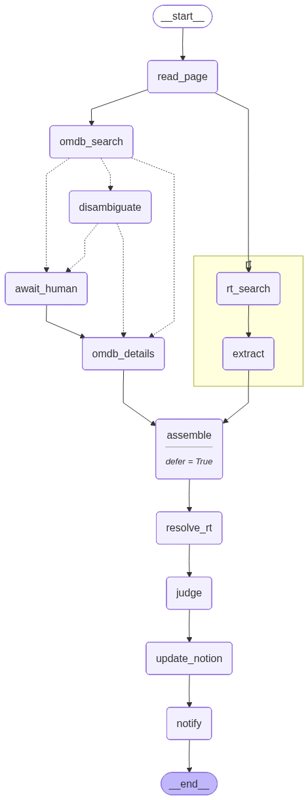

# Notion Movie/TV Enrichment Agent

A Python + **LangGraph** service that enriches a Notion **Watchlist** with IMDb rating,
Rotten Tomatoes scores, plot, and genre. A learning project for LangGraph primitives.

Design docs: [`CONTEXT.md`](CONTEXT.md) · [`RESEARCH.md`](RESEARCH.md) ·
[`docs/adr/`](docs/adr) · [`TASKS.md`](TASKS.md).

## The enrichment graph

`reconcile()` runs each Watchlist Entry through this graph. The OMDb and Rotten Tomatoes
lanes **fan out in parallel**, then fan in to `assemble` before the write-back:



Regenerate the diagram: `uv run python -m notion_db_updater --generate-graph`.

## Running it

Requires `uv`. Copy `.env.example` → `.env` (only `NOTION_MOVIE_DB_TOKEN` is needed to boot).

```bash
uv run python -m notion_db_updater                    # read + print the Watchlist
uv run python -m notion_db_updater --enrich <page_id> # enrich ONE Entry
uv run python -m notion_db_updater --reconcile        # sweep the whole Watchlist once
uv run python -m notion_db_updater --serve            # in-process cron loop
```

## Deploy (Docker Compose, always-on)

Phase 10 (ADR 0009 / 0007) — one long-lived container running `--serve` (in-process cron +
Slack Socket Mode), kept up by `restart: always`. No inbound HTTP (Socket Mode is an outbound
WebSocket), so no ports are exposed.

```bash
make secrets              # project .env's 9 secret keys into secrets/* (gitignored)
docker compose up --build # start the always-on agent
```

- **Secrets** are file-mounted (`docker-compose.yml` → `secrets:`), never baked into the image
  or the compose file. `make secrets` regenerates `secrets/*` from `.env` — rerun after
  rotating a key. `entrypoint.sh` bridges `/run/secrets/*` into env vars on boot.
- **State** (the SQLite checkpointer) lives on the **named volume** `checkpoint-data`, so a
  paused `awaiting_input` HITL run survives a container restart (ADR 0007).
- **The LLM endpoint** runs on the host — compose points `OPENAI_BASE_URL` at
  `http://host.docker.internal:8888/v1` (auto on Docker Desktop; `extra_hosts: host-gateway`
  covers Linux). Non-secret tuning (intervals, RPMs, models, LangSmith project) is read from
  `.env`/env via compose `environment:` with sensible defaults.

Verify durability: create an ambiguous Entry → it goes `awaiting_input` → `docker compose
restart` mid-wait → the paused graph resumes from the volume-backed `.sqlite`.
